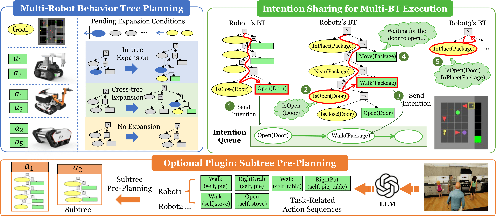
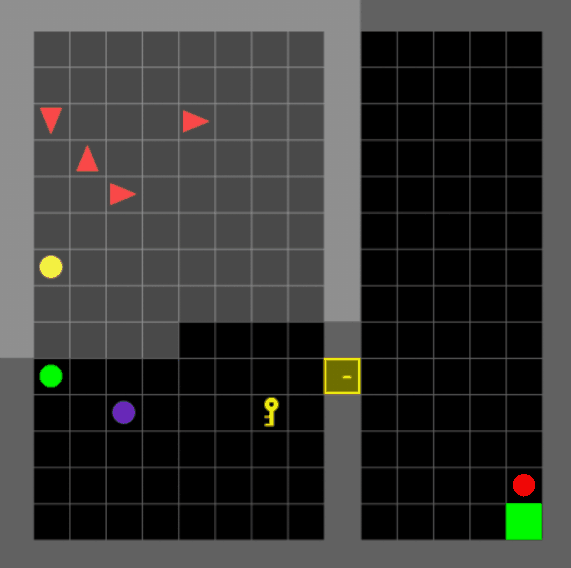

# MRBTP: Efficient Multi-Robot Behavior Tree Planning and Collaboration (AAAI Oral)    

<div align="center">


[[Website]](https://dids-ei.github.io/Project/MRBTP/)
[[arXiv]](https://arxiv.org/abs/2502.18072)
[[PDF]](https://arxiv.org/pdf/2502.18072)



</div>

## 🛠️ Installation

### Environment Setup
Create and activate a new conda environment:
```shell
conda create --name mabtpg python=3.10
conda activate mabtpg
```

### Installation of MABTPG
```shell
cd MABTPG
pip install -e .
```

### 1. Download the VirtualHome executable for your platform (Only Windows is tested now):

| Operating System | Download Link                                                                      |
|:-----------------|:-----------------------------------------------------------------------------------|
| Linux            | [Download](http://virtual-home.org/release/simulator/v2.0/v2.3.0/linux_exec.zip)   |
| MacOS            | [Download](http://virtual-home.org/release/simulator/v2.0/v2.3.0/macos_exec.zip)   |
| Windows          | [Download](http://virtual-home.org/release/simulator/v2.0/v2.3.0/windows_exec.zip) |

### 2.  Execute Existing MiniGrid and BabyAI Environments:
#### (1) Running Existing Environments
1. Select a scenario from the MiniGrid_all_scenarios.txt file.
2. Input the chosen scenario and num_agent in the test_gridworld/minigrid_env.py file. Agents will load with a default set of random behavior trees.

#### (2) Custom Environment Setup
Design custom room layouts in test_gridworld/custom_env.py using functions like self.grid.horz_wall and self.put_obj to construct your scenes.


## 📂 Directory Structure

```
mabtpg
│
├── agent - Configuration for intelligent agents.
├── algo - Training and decision-making algorithms.
│   └── llm_client - Modules for large language model integration.
├── btp - Behavior tree planning algorithms.
│   └── base
│       └── planning_agent
│       └── planning_condition
│   ├── DMR - Planning algorithm interface.
│   ├── mabtp - Multi-robot behavior tree planning algorithms.
│   ├── maobtp - Priority-queue-based multi-robot behavior tree planning algorithms.
│   └── captp - Subtree pre-planning algorithms.
├── behavior_tree - Components of the behavior tree engine.
├── envs - Environments for agent interaction.
│   ├── base - Foundational elements for environments.
│   ├── gridenv - Grid-based testing environment.
│   │   └── minigrid - Warehouse Management scenario.
│   ├── virtualhome - Home Service scenario.
│   └── numericenv - Numerical simulation platform.
└── utils - Supporting functions and utilities.

simulators - Platforms for realistic training environments.

test_experiment - Modules for testing behavior trees planning, LLMs, and scene interactions.
│
├── exp1_robustness_parallelism
│   ├── code
│   └── results
└── exp2_subtree_llms
    ├── code
    │   ├── data
    │   └─ llm_data
    └── results
```


## 🚀 Getting Started
Execute multi-agent behavior tree planning algorithms in our extended MiniGrid environment:

``` shell
python test_multi_minigrid_single_demo/main.py
```




## 🧪 实验复现与代码解析

### Table 1（MRBTP 基线复现）
- 主脚本：`test_experiment/exp3_baselines/shuffle_goal_SR_TS_RS.py`
- 算法对应：论文 MRBTP = 代码 `mabtpg/btp/mabtp.py`（class `MABTP`）
- 运行要点：
  - `run_baseline=False` 使用 MRBTP（多机器人 BT 规划）；`True` 为 BT-Expansion 基线
  - 环境：`MiniCompEnv`（计算型 MiniGrid），随机生成可解目标
  - 统计：默认 `total_time=500` 轮，打印成功率与步数
- 命令示例：
  ```bash
  conda activate mabtpg
  cd MABTPG
  python test_experiment/exp3_baselines/shuffle_goal_SR_TS_RS.py
  ```

### Table 2（Subtree Pre-planning + LLM）
- 步骤 1：LLM 生成子树  
  - GPT-3 版：`test_experiment/exp2_subtree_llms/code/01_llm_get_subtree.py`  
  - 多模型版：`test_experiment/exp2_subtree_llms/code/03_llm_get_subtree_more_LLMs.py`
- 步骤 2：加载子树并评估  
  - GPT-3 版：`test_experiment/exp2_subtree_llms/code/02_load_json_evaluate.py`  
  - 多模型版：`test_experiment/exp2_subtree_llms/code/04_load_json_evaluate_more_LLMs.py`
- 关键选项：
  - `with_comp_action=True` 时由 `DMR` 内部切换到 `MAOBTP`（支持组合动作），否则使用 MRBTP（`MABTP`）
  - `use_comp_subtask_chain` / `use_atom_subtask_chain` 控制任务链配置
- 环境：`VHCompEnv`（VirtualHome 计算环境，Table 2）  
  - 说明：Table 2 的复现不需要启动 Unity 仿真器，`VHCompEnv` 直接在计算图上评估；只有使用 `VHEnv` / `UnityEnvironment` 做真实渲染时才需启动 VirtualHome 可执行文件。  
  结果 CSV 输出到 `test_experiment/exp2_subtree_llms/results/`

### 代码与算法映射
- `mabtpg/btp/mabtp.py`：MRBTP 主体（多机器人 BT 规划，后向搜索）
- `mabtpg/btp/maobtp.py`：优先队列版本，支持组合动作（用于 Subtree Pre-planning）
- `mabtpg/btp/DMR.py`：实验接口，依据 `with_comp_action` 选择 `MABTP` 或 `MAOBTP`
- 环境：
  - `MiniCompEnv`：MiniGrid 计算实验（Table 1）
  - `MiniGridToMAGridEnv`：MiniGrid 可视化演示
  - `VHCompEnv`：VirtualHome 计算实验（Table 2）

### 复现前准备
- 安装依赖并 `pip install -e .`
- 按需下载 VirtualHome 可执行文件（见上方安装章节）
- 设置 OpenAI 等 LLM API Key（用于 01/03 脚本），路径见脚本内注释


## 🧭 多智能体网格仿真平台接口与使用

适用场景：Table 1 及 MiniGrid 演示。核心环境封装在 `mabtpg/envs/gridenv`。

- 主要类  
  - `MiniCompEnv`：计算实验用，轻量、无渲染，接口兼容 `Env` 基类  
  - `MiniGridToMAGridEnv`：渲染/可视化包装器，基于 MiniGrid 原生环境  
  - 公共接口：`reset()`、`step()`、`create_action_model()`、`check_conflict()`、`agents` 列表
- 基本使用（示意）
  ```python
  env = MiniCompEnv(num_agent=4, goal=goal, start=start)
  env.num_rooms = 4
  env.objects_rooms_dic = {...}
  action_model = env.create_action_model()  # 为每个 agent 构建 Action 类实例列表
  obs = env.reset()
  obs, done, _, _, agents_one_step, finish_and_fail = env.step()
  ```
- 行为库：`BehaviorLibrary` 从 `envs/gridenv/minigrid_computation_env/behavior_lib` 载入 Condition / Action 类。可通过为 `agent.behavior_dict` 指定 `Action`/`Condition` 列表再 `create_behavior_lib()`。
- 绑定 BT：规划后调用 `agent.bind_bt(bt)`，或使用示例脚本中的 `bind_bt(bt_list)`。
- 可复现性：设置 `random.seed(...)` 与 `np.random.seed(...)`；多轮统计使用循环计数成功率/步数。


## 🏗️ 框架设计与行为树构建、仿真平台链接

- 规划层（BTP）
  - MRBTP：`mabtpg/btp/mabtp.py`，后向搜索生成多机器人 BT
  - MAOBTP：`mabtpg/btp/maobtp.py`，带优先队列/组合动作
  - DMR：`mabtpg/btp/DMR.py`，统一入口，`with_comp_action` 选择 MABTP/MAOBTP
- 行为树生成
  - `PlanningAgent.one_step_expand` 推导前提条件集，累积在 `planned_agent_list`
  - `output_bt_list(behavior_libs)` 将规划结果转为可执行 BT；`get_btml_list()` 输出 BTML
  - Composite/Subtree：`CompositeActionPlanner` 生成 cost=0 的组合动作及子树 BTML，注入 `MAOBTP`
- 仿真平台链接
  - Grid 计算/演示：`MiniCompEnv`（无渲染），`MiniGridToMAGridEnv`（可视化）
  - VirtualHome 计算：`VHCompEnv`（Table 2，用于离线评估，无需开启 Unity）
  - 若需真实渲染：使用 `VHEnv` / `UnityEnvironment`，需下载并启动 VirtualHome 可执行文件
- 端到端流程（示意）
  1. 配置环境与目标：构造 `goal` / `start`，实例化 `Env`，生成 `action_model`
  2. 选择规划器：`MABTP`（默认）或 `MAOBTP`（`with_comp_action=True`）
  3. 运行规划：`planning(frozenset(goal), action_lists=action_model)` 或 `bfs_planning(...)`
  4. 输出并绑定 BT：`bt_list = planner.output_bt_list(behavior_libs)`；`agent.bind_bt(bt_list[i])`
  5. 仿真执行：在对应环境循环 `step()`，统计成功率与步数


## License

This project is licensed under the MIT License - see the [LICENSE](LICENSE) file for details.
