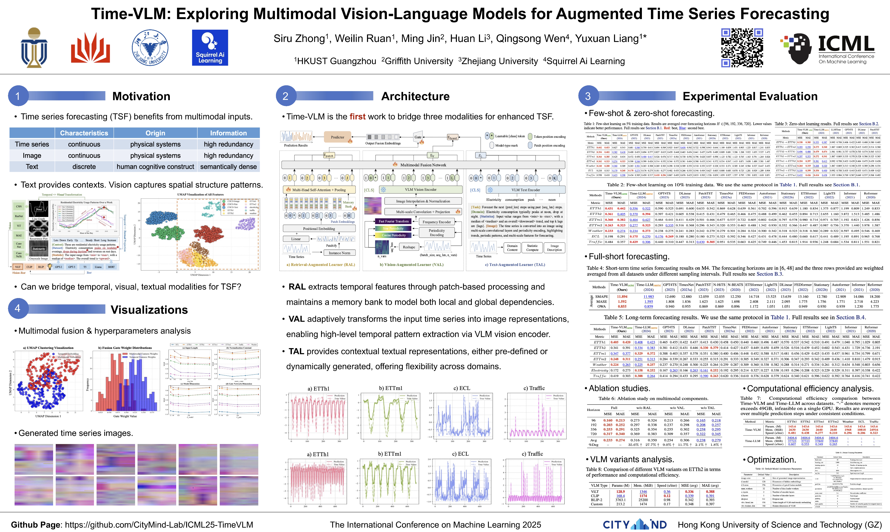

# Time-VLM: Exploring Multimodal Vision-Language Models for Augmented Time Series Forecasting

<div align="center">

[](https://arxiv.org/abs/2502.04395)
[](https://icml.cc/virtual/2025/poster/44762)
[](https://www.python.org/)
[](https://pytorch.org/)
[](https://github.com/CityMind-Lab/ICML25-TimeVLM)

</div>

<div align="center">



*Time-VLM Framework Architecture*

</div>

## 📖 Overview

Time-VLM provides an extensible framework for integrating various Vision-Language Models (VLMs) with time series forecasting. It supports multiple VLM types (CLIP, BLIP2, ViLT) and enables flexible multimodal experiments.

## 🚀 Quick Start

### Environment Setup

To set up the environment, install Python 3.8 with Pytorch 1.4.4. Use the following commands for convenience:

```bash
conda create -n Time-VLM python=3.8
conda activate Time-VLM
pip install -r requirements.txt
```

### Dataset Preparation

Download the pre-processed datasets from:
- **Google Drive**: [Download Link](https://drive.google.com/drive/folders/13Cg1KYOlzM5C7K8gK8NfC-F3EYxkM3D2?usp=sharing)
- **Baidu Drive**: [Download Link](https://pan.baidu.com/s/1r3KhGd0Q9PJIUZdfEYoymg?pwd=i9iy)

Place the downloaded data in the `./dataset` folder.

### Running Experiments

Run the following scripts for different forecasting tasks:

```bash
# Long-term Forecasting (Full-shot, 100% data)
bash ./scripts/TimeVLM_long_1.0p.sh

# Long-term Forecasting (Few-shot, 10% data)
bash ./scripts/TimeVLM_long_0.1p.sh

# Short-term Forecasting
bash ./scripts/TimeVLM_short.sh

# Zero-shot Transfer Learning
bash ./scripts/TimeVLM_transfer.sh
```

> **⚠️ Important Notes**: 
> - Ensure you have downloaded the datasets and placed them in the correct directory
> - The default parameters provided in scripts are a good starting point, but you need to adjust them based on your specific dataset and requirements
> - **Script Naming Convention**: `TimeVLM_long_X.Xp.sh` where `X.Xp` indicates the percentage of data used (e.g., `1.0p` = 100%, `0.1p` = 10%)

## 📁 Project Structure

```
Time-VLM/
 README.md                 # Project documentation
 requirements.txt          # Python dependencies
 run.py                    # Main entry point for training and testing
 dataset/                  # Dataset directory
    ETT/                  # ETT datasets
    Weather/              # Weather dataset
    Electricity/          # Electricity dataset
    Traffic/              # Traffic dataset
    ...
 scripts/                  # Training and evaluation scripts
    TimeVLM_long_1.0p.sh # Long-term forecasting (full-shot, 100% data)
    TimeVLM_long_0.1p.sh # Long-term forecasting (few-shot, 10% data)
    TimeVLM_short.sh     # Short-term forecasting
    TimeVLM_transfer.sh  # Zero-shot transfer learning
    ...
 src/                      # Source code
    TimeVLM/             # Time-VLM model implementation
       model.py         # Main model architecture
       vlm_custom.py    # Custom VLM implementations
       vlm_manager.py   # VLM manager for different types
       ...
    utils/                # Utility functions
    models/               # Model implementations
    layers/               # Custom layers
    ...
 exp/                      # Experiment configurations
 logs/                     # Training logs
 ts-images/               # Generated time series images
 ...
```

## ⚙️ Configuration & Tuning

### Core Parameters

| Parameter | Default | Range | Description |
|:---------:|:-------:|:-----:|:------------|
| **`d_model`** | `128` | `32-512` | **Most Important**: Model dimension |
| **`dropout`** | `0.1` | `0.1-0.5` | Dropout rate |
| **`learning_rate`** | `0.001` | `0.0001-0.01` | Learning rate |
| **`batch_size`** | `32` | `-` | Adjust based on GPU memory |
| **`image_size`** | `56` | `28-112` | Time series image size |
| **`periodicity`** | `24` | `-` | Data periodicity for image generation |
| **`norm_const`** | `0.4` | `0.1-1.0` | Normalization constant |

### Script Parameters

| Parameter | Default | Description |
|:---------:|:-------:|:------------|
| **`percent`** | `1.0` | Data usage ratio |
| **`vlm_type`** | `clip` | VLM type [clip, blip2, vilt, custom] |
| **`image_size`** | `56` | Time series image size (28-224) |
| **`periodicity`** | `24` | Data periodicity for image generation |
| **`use_mem_gate`** | `True` | Memory fusion gate |
| **`finetune_vlm`** | `False` | Finetune pre-trained VLM |
| **`three_channel_image`** | `True` | Generate RGB images |
| **`learnable_image`** | `True` | Learnable image generation |


## 📚 Citation

If you find this repository useful, please cite our paper:

```bibtex
@inproceedings{zhong2025time,
  title={Time-VLM: Exploring Multimodal Vision-Language Models for Augmented Time Series Forecasting},
  author={Zhong, Siru and Ruan, Weilin and Jin, Ming and Li, Huan and Wen, Qingsong and Liang, Yuxuan},
  booktitle={Proceedings of the 42nd International Conference on Machine Learning},
  year={2025}
}
```