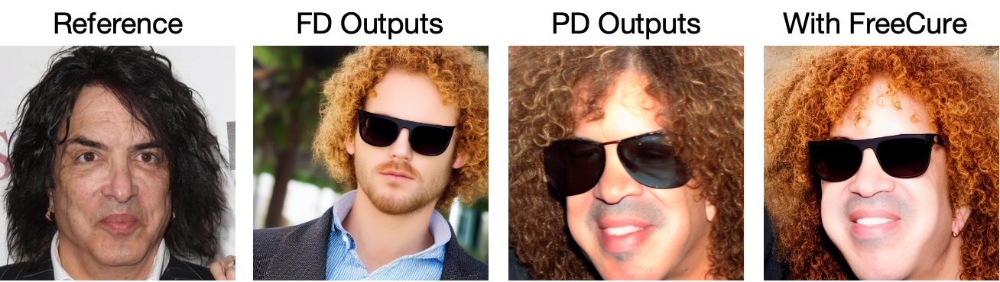

# Example of Integrating FreeCure into Face2Diffusion
This example demonstrate an example of how to integrate FreeCure in Face2Diffusion to improve its prompt-following performance. 

## Environment Preparation
Please following Face2Diffusion's original environment [setup](https://github.com/mapooon/Face2Diffusion) to create the initial environment

Add following packages to enable Segment-Anything function.
```shell
pip install inference[yolo-world]==0.9.13
pip install onnxsim==0.4.35
pip install git+https://github.com/facebookresearch/segment-anything.git # sam
pip install timm # required
```

## Run the code
Follow the Face2Diffusion style prompt formula to set your prompt
```shell
python inference_f2d.py \
	  --w_map ./checkpoints/mapping.pt \
	  --w_msid ./checkpoints/msid.pt \
	  -i ./input/1.jpg \
	  -p "f l with blonde curly hair, wearing sunglasses" \
	  -g "woman" \
	  -o ./outputs \
	  -n 1
	
```

You should obtain refinement results like this:

<div align="center">
</img>
</div>
