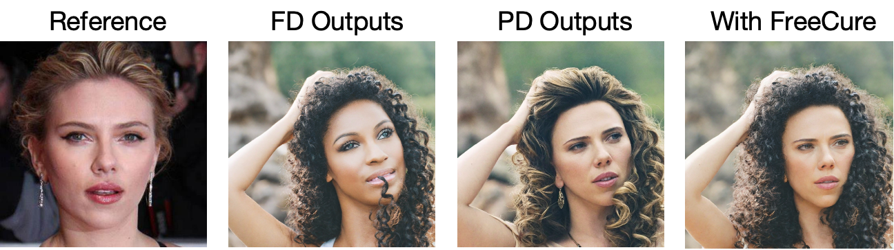

# Example of Integrating FreeCure into PhotoMaker
This example demonstrate an example of how to integrate FreeCure in PhotoMaker to improve its prompt-following performance. 

## Environment Preparation
Please following PhotoMaker's original environment [setup](https://github.com/TencentARC/PhotoMaker) to create the initial environment

Add following packages to enable Segment-Anything function.
```shell
pip install inference[yolo-world]==0.9.13
pip install onnxsim==0.4.35
pip install git+https://github.com/facebookresearch/segment-anything.git # sam
pip install timm # required
```

## Run the code
Follow the PhotoMaker style prompt formula to set your prompt
```shell
python run_photomaker_freecure.py \
    --prompt "a woman img with long black curly hair" \
    --reference-folder ./examples/scarletthead_woman \
    --output-folder "./outputs/"
```
You should obtain refinement results like this:

<div align="center">
</img>
</div>
