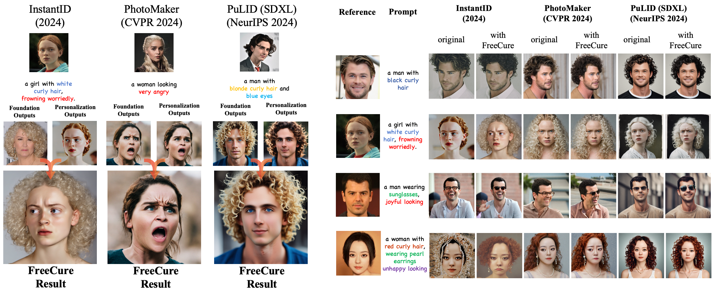
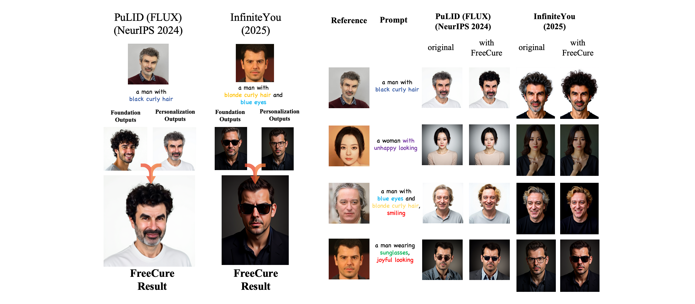

<!--
Hey, thanks for using the awesome-readme-template template.  
If you have any enhancements, then fork this project and create a pull request 
or just open an issue with the label "enhancement".

Don't forget to give this project a star for additional support ;)
Maybe you can mention me or this repo in the acknowledgements too
-->

<!--
This README is a slimmed down version of the original one.
Removed sections:
- Screenshots
- Running Test
- Deployment
- FAQ
- Acknowledgements
-->

<h1 align="center" style="font-family: 'Courier New', monospace; color: #e74c3c;">Foundation Cures Personalization: Improving Personalized Models' Prompt Consistency via Hidden Foundation Knowledge</h1>

<h3 align="center">NeurIPS 2025</h1>

<div align="center">
</img>
</div>

 <div align="center">

[](https://arxiv.org/pdf/2411.15277)&nbsp;
[](https://freecure.github.io/)&nbsp;

</div>

<div align="center">
</img>
</div>


## TL;DR
Personalization Models fail to control facial attributes accurately. FreeCure fixes this problem with a training-free framework without harming these models' impressive ability in maintaining identity information.

## 🌟 Introduction
Personalization models fuse identity embedding into the cross-attention layers. Our preliminary experimental findings reveal that identity embeddings compromise the effectiveness of other tokens in the prompt, thereby limiting high prompt consistency and controllability. Moreover, by deactivating identity embedding, personalization models still demonstrate the underlying foundation models' ability of controlling multiple facial attributes precisely. It suggests that such foundation models' knowledge can be leveraged to **cure** the ill-aligned prompt consistency of personalization models.

## 🔆 Features
* FreeCure is totally training-free.
* FreeCure can enhance a broad range of facial attributes and significantly improve the personalization model's prompt consistency while not disrupting its well-trained ability for identity fidelity.
* FreeCure can be seamlessly integrated into a wide range of mainstream personalization models.

## Results for FreeCure on Different Baselines and Facial Attributes
FreeCure can handle several baselines built upon different foundation models (e.g., SD-v1.5, SDXL, FLUX.1-dev)

For more results, please refer to the [paper](https://arxiv.org/pdf/2411.15277) and the [project page](https://freecure.github.io/) 

<div align="center">
</img>
</div>

<div align="center">
</img>
</div>

## 🚀 Run the Codes

### Prepration
Download the BiSeNet and SAM's weights: [BiSeNet](https://drive.google.com/open?id=154JgKpzCPW82qINcVieuPH3fZ2e0P812) and [SAM](https://huggingface.co/han-cai/efficientvit-sam/resolve/main/xl1.pt). Place them in **/Path/to/this/Repo/freecure/face_parsing/checkpoints**
```
├── FreeCure
    ├── examples
    ├── freecure
        ├── fasa_module
        ├── face_parsing
            ├── bisenet
            ├── effcientvit
            ├── checkpoints
                ├── xl1.pt
                ├── 79999_iter.pth
```

Modify the configuration file (./freecure/cfg.json) in the source code
```json
{
    "local_machine":{
        "repo": "/Path/to/Your/Repo/",
        "bisenet": "/Path/to/Your/Repo/freecure/face_parsing/checkpoints/79999_iter.pth",
        "sam": "/Path/to/Your/Repo/freecure/face_parsing/checkpoints/xl1.pt"
    }
}
```

To enable face parsing, download following dependencies:
```shell
pip install inference[yolo-world]==0.9.13
pip install onnxsim==0.4.35
pip install git+https://github.com/facebookresearch/segment-anything.git # sam
pip install timm # required
```

We provide examples of PhotoMaker and InstantID, please refer to README.md in the each example folder.


## Citation
If you find this work helpful, please consider citing:
```
@article{cai2024foundation,
  title={Foundation Cures Personalization: Recovering Facial Personalized Models' Prompt Consistency},
  author={Cai, Yiyang and Jiang, Zhengkai and Liu, Yulong and Jiang, Chunyang and Xue, Wei and Luo, Wenhan and Guo, Yike},
  journal={arXiv preprint arXiv:2411.15277},
  year={2024}
}
```
