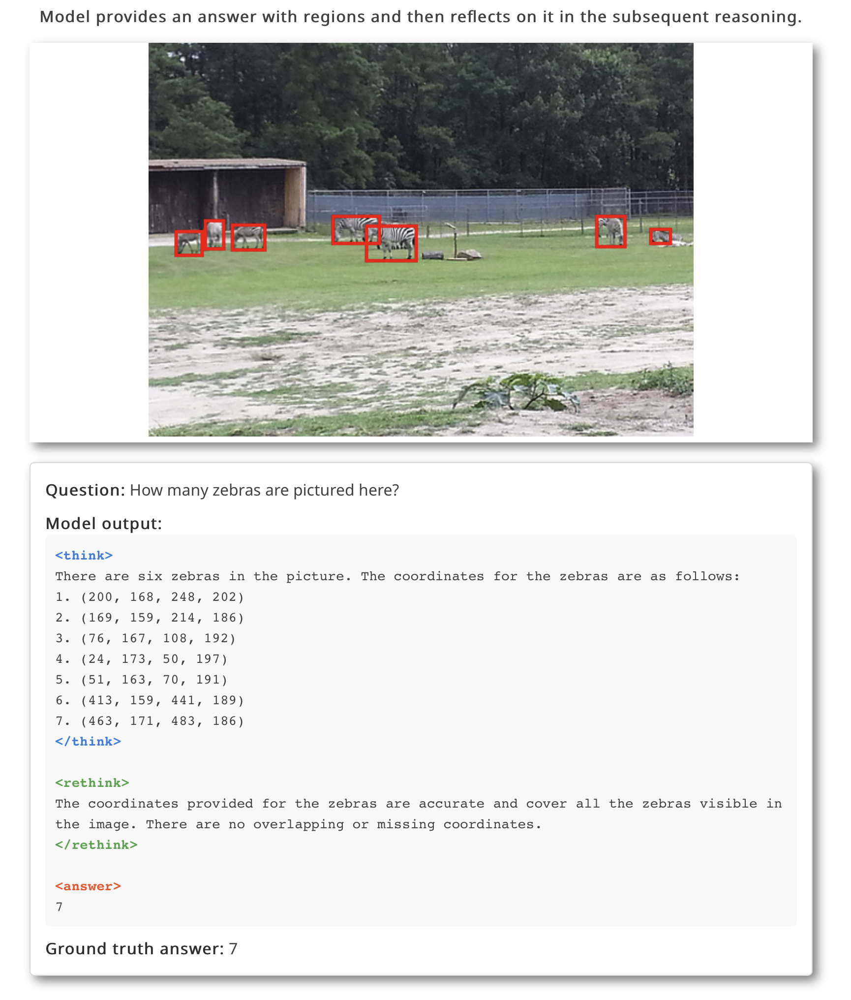
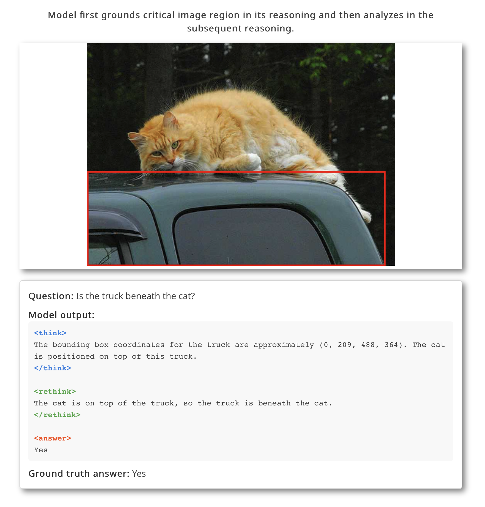
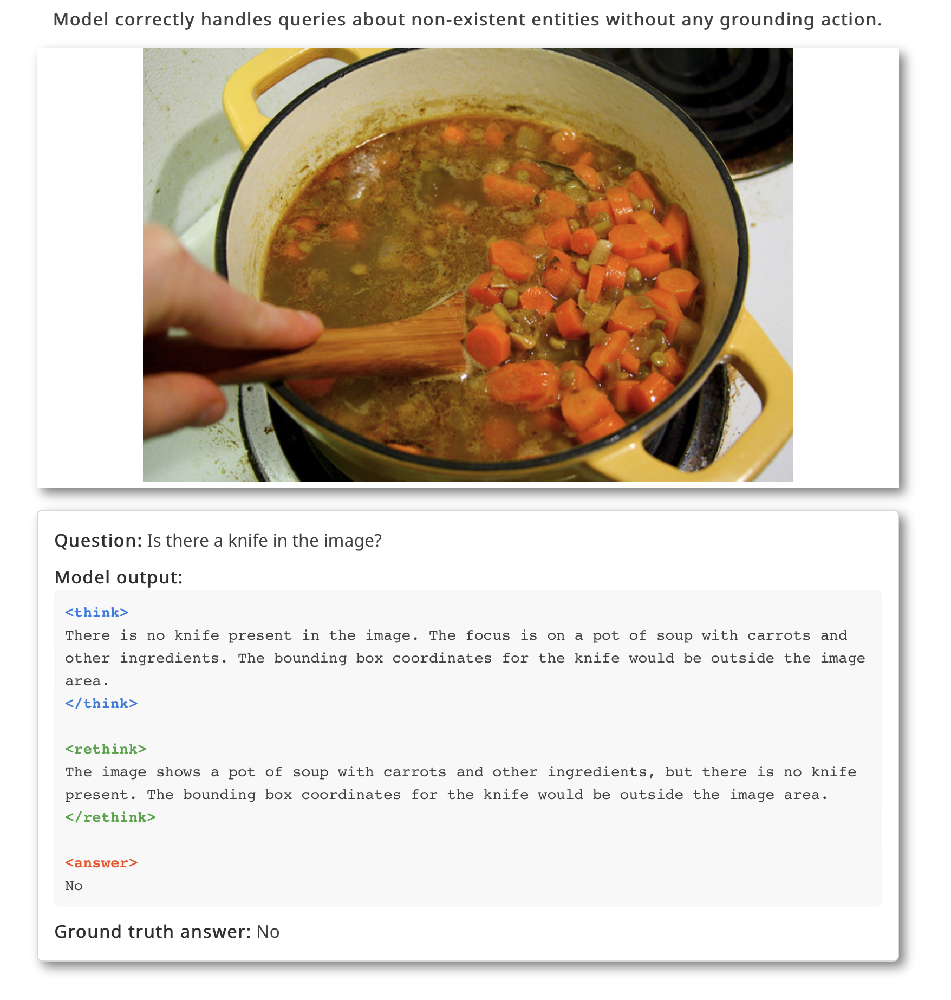

# GRIT: Teaching MLLMs to Think with Images

**Grounded Reasoning wiht Texts and Images (GRIT)** is a novel method for training Multimodal Large Language Models (MLLMs) to perform grounded reasoning by generating reasoning chains that interleave natural language and explicit bounding box coordinates. This approach can use as few as **20 training data samples** to enable models to ground their reasoning in specific image regions, achieving a **unified grounding and reasoning ability**.

<div align="center">
  <a href="https://arxiv.org/abs/2505.15879">
    
  </a>
  <a href="https://grounded-reasoning.github.io">
    
  </a>
  <a href="https://616b78fb4da228e753.gradio.live">
    
  </a>
</div>

## Examples of GRIT's Grounded Reasoning



<details>
<summary>More examples (click to expand)</summary>





</details>

## Pretrained Models

Pretrained GRIT models are available on Hugging Face:

- [GRIT-20-InternVL-2B](https://huggingface.co/yfan1997/GRIT-20-InternVL-2B): GRIT model based on InternVL 2B
- [GRIT-20-Qwen2.5-VL-3B](https://huggingface.co/yfan1997/GRIT-20-Qwen2.5-VL-3B): GRIT model based on Qwen2.5-VL 3B

## Setup

1. Optional conda environment install
    ```bash
    conda create -n grit python=3.12
    conda activate grit
    ```
2. **Clone the repository with submodules:**
   ```bash
   git clone --recurse-submodules https://github.com/UeFan/GRIT.git
   cd GRIT
   ```
3. **Run the setup script:**
   ```bash
   bash setup.sh
   ```
4. **Set up Weights & Biases for experiment tracking:**
   ```bash
   pip install wandb
   wandb login
   ```

5. **Set up your OpenAI credentials:**
   Create a file named `gpt_credentials.py` with the following content:
   ```python
   api_base = ""
   api_key = ""
   deployment_name = ""
   api_version = ""
   ```
   Fill in your credentials as needed for API access.

6. **Download data from Hugging Face:**
   ```bash
   git lfs install
   git clone https://huggingface.co/datasets/yfan1997/GRIT_data
   ```
   Follow the instructions in GRIT_data/README.md to download image data and place it within the GRIT_data directory.
7. **Login with Huggingface cli**
    ```bash
    pip install huggingface_hub
    huggingface-cli login
    ```


## Training and evaluation

### Training

To train models with GRIT using the grounded reasoning approach:

#### InternVL
```bash
bash scripts/8_80gpu_20_train_internvl_grounded_reasoning_single_turn_think_rethink.sh
```

#### Qwen
```bash
bash scripts/8_80gpu_20_train_qwen_grounded_reasoning_single_turn_think_rethink.sh
```

### Evaluation

#### Using training scripts for evaluation
To evaluate models trained, apply the following to the training script to convert it to evaluation only mode.

1. change 
    ```bash
    --config_file ./accelerate_configs/deepspeed_zero2.yaml
    ```
    to 
    ```bash
    --config_file ./accelerate_configs/multi_gpu.yaml
    ```

2. add the following parameters to any training script:
    ```bash
    --num_train_epochs 0
    --eval_on_start True 
    --model_name_or_path MODEL_NAME
    ```

    Replace `MODEL_NAME` with the path to your trained model checkpoint.

 3. to extract the evaluation result:
    ```bash
    python extract_eval_results.py
    --base-output ./outputs/
    --gt-path ./GRIT_data
    --out-dir .
    ```
    
More evaluation scripts that are for zero-shot evaluation are available in `scripts/`, where they evaluate models with different prompts to fit zero-shot manner.


## Inference

<details>
<summary>Inference with Qwen2.5-VL Model (click to expand)</summary>

```python
import re
import torch
from transformers import Qwen2_5_VLForConditionalGeneration, AutoProcessor
from qwen_vl_utils import process_vision_info  # From the GRIT repo

# Load model and processor
model_id = "yfan1997/GRIT-20-Qwen2.5-VL-3B"  # or your local checkpoint path
model = Qwen2_5_VLForConditionalGeneration.from_pretrained(
    model_id,
    torch_dtype="bfloat16",
    device_map={"": 0},
    attn_implementation="flash_attention_2",
).eval()

processor = AutoProcessor.from_pretrained(model_id)

# Prepare input
image_path = "path/to/your/image.jpg"
query = "Ask a question here."

# Format prompt with GRIT thinking structure
prompt_suffix = (
    " First, think between <think> and </think> while output necessary "
    "coordinates needed to answer the question in JSON with key 'bbox_2d'. "
    "Then, based on the thinking contents and coordinates, rethink between "
    "<rethink> </rethink> and then answer the question after <answer>.\n"
)

# Create messages
messages = [
    {
        "role": "user",
        "content": [
            {"type": "image", "image": image_path},
            {"type": "text", "text": f"Question: {query}{prompt_suffix}"},
        ],
    }
]

# Apply chat template
chat_text = processor.apply_chat_template(
    messages, tokenize=False, add_generation_prompt=True
)

# Process inputs
img_inputs, vid_inputs = process_vision_info(messages)
inputs = processor(
    text=[chat_text],
    images=img_inputs,
    videos=vid_inputs,
    padding=True,
    return_tensors="pt",
).to(model.device)

# Run inference
generation_config = model.generation_config
generation_config.max_new_tokens = 1024
generation_config.temperature = 0.001
generation_config.top_k = 1
generation_config.top_p = 0.0

with torch.inference_mode():
    gen_ids = model.generate(**inputs, generation_config=generation_config)

output = processor.batch_decode(
    gen_ids[:, inputs.input_ids.shape[1]:],
    skip_special_tokens=True,
    clean_up_tokenization_spaces=False,
)[0]

# Parse bounding boxes
bbox_regex = re.compile(r"\b\d+,\s*\d+,\s*\d+,\s*\d+\b")
bboxes = []
for match in bbox_regex.findall(output):
    try:
        x1, y1, x2, y2 = map(int, match.split(","))
        bboxes.append((x1, y1, x2, y2))
    except ValueError:
        pass

print(f"Output: {output}")
print(f"Detected bounding boxes: {bboxes}")
```

For a complete implementation with visualization, see `gradio_qwen.py` in the repository.
</details>

<details>
<summary>Inference with InternVL Model (click to expand)</summary>

```python
import torch
from transformers import AutoTokenizer, AutoModel
from internvl.model.internvl_chat.modeling_internvl_chat import InternVLChatModel
from internvl.train.dataset import build_transform, dynamic_preprocess
from PIL import Image
import torchvision.transforms as T
from torchvision.transforms.functional import InterpolationMode

# 1. Load model and tokenizer
model_path = "yfan1997/GRIT-20-InternVL-2B"  # or path to your fine-tuned GRIT model
model = InternVLChatModel.from_pretrained(
    model_path,
    torch_dtype=torch.bfloat16,
    use_flash_attn=True,
    trust_remote_code=True
).eval().cuda()

tokenizer = AutoTokenizer.from_pretrained(
    model_path, 
    trust_remote_code=True, 
    use_fast=False
)

# 2. Helper functions for image processing
def load_image(image_file, input_size=448, max_num=5):
    image = Image.open(image_file).convert('RGB')
    transform = build_transform(False,input_size=input_size)
    images = dynamic_preprocess(image, image_size=input_size, use_thumbnail=True, max_num=max_num)
    pixel_values = [transform(image) for image in images]
    pixel_values = torch.stack(pixel_values)
    return pixel_values

# 3. Load and process image
# Prepare input
image_path = "path/to/your/image.jpg"
query = "Ask a question here."

pixel_values = load_image(image_path, max_num=5).to(torch.bfloat16).cuda()

# 4. Prepare prompt
prompt_suffix = (
    " First, think between <think> and </think> while output necessary "
    "coordinates needed to answer the question in JSON with key 'bbox_2d'. "
    "Then, based on the thinking contents and coordinates, rethink between "
    "<rethink> </rethink> and then answer the question after <answer>.\n"
)
question = '<image>\nQuestion: ' + query + prompt_suffix

# 5. Generate response
generation_config = dict(max_new_tokens=1024, temperature=0.001, top_k=1, top_p=0.)
response = model.chat(tokenizer, pixel_values, question, generation_config)

print(f'User: {question}\nAssistant: {response}')
```

Note: The InternVL model uses a different coordinate format ([x1,y1,x2,y2] with range [0, 1000]) compared to the Qwen model's format.
</details>

## Citation

```
@misc{fan2025grit,
      title={GRIT: Teaching MLLMs to Think with Images}, 
      author={Yue Fan and Xuehai He and Diji Yang and Kaizhi Zheng and Ching-Chen Kuo and Yuting Zheng and Sravana Jyothi Narayanaraju and Xinze Guan and Xin Eric Wang},
      year={2025},
      eprint={2505.15879},
      archivePrefix={arXiv},
      primaryClass={cs.CV},
      url={https://arxiv.org/abs/2505.15879}, 
}
``` 
